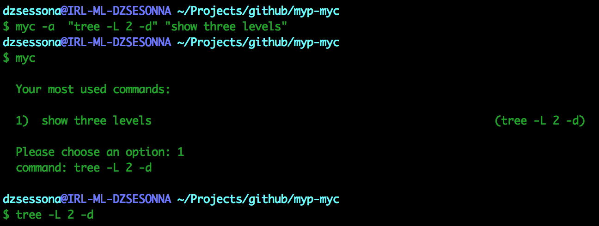
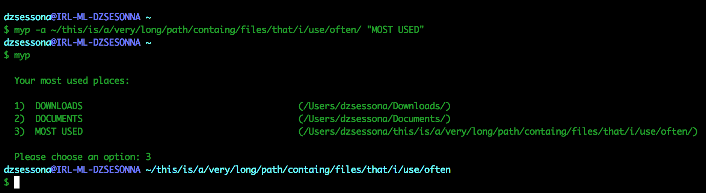

     
                                                           
       _____ ___.__.______             _____ ___.__. ____  
      /     <   |  |\____ \   ______  /     <   |  |/ ___\ 
     |  Y Y  \___  ||  |_> > /_____/ |  Y Y  \___  \  \___ 
     |__|_|  / ____||   __/          |__|_|  / ____|\_____|
           \/\/     |__|                   \/\/          
           

**Keep track of your commands and directories without headaches.**

* [What is it](#what-is-it)
* [How does it work](#how-does-it-work)
       * [myc for commands](#myc-for-commands)
       * [myp for paths](#myp-for-paths)
* [Installation](#installation)


## What is it

Have you ever found yourself in the situation of looking into the history of your bash for a particualr command that you 
can't remember? Or maybe searching the web for it while you are thinking "I ran this command a million times, and I can't ever remember it!"
*I am one of those people !* So I wrote these two little scripts that allow me to store and retrieve with a couple of keystrokes 
some very long commands (or particulary complicated ones), or very long paths that are hard to remember. Maybe someone else can
find it useful.  

## How does it work

Once installed, the script creates a file in your home which is nothing more and nothing less that a list of commands (or paths) 
and a description. You can add at any time a particular command that you like but is hard to remember, and then just re-call it 
running the script again. Easier to give an example than trying to explain it maybe, here is an example of myc and myp:

### myc for commands

Suppose you wuite often use the program 'tree' to see what is the structure of a particular folder. By default it prints on the
screen a nice tree of all the folders and files. I know that the flag -L number defines the number of levels to be displayed, and -d 
actually does not list the files but only the folders. The problem is that I never remember those flags. So I add it to myc as follow:

```
myc -a  "tree -L 2 -d" "show three levels"
```



Now at any time I can type `myc` in my console, and if then I answer 1 the command is selected... but... Wait, nothing happened? 

No, at this point the console does not run the command, but it is saved in your history, so if you just press the up arrow in your
keyboard the command pops up and is ready to be modified or executed. This script behaves like that to prevent that dangerous
commands are run by mistakes, and also allow you to edit the command before running it. Anyway, to change this behaviour you can 
comment line 131 and 134 and uncomment 130 and 136. In that way as soon as you answer the menu, the command will be launched immediately, but be careful,
**it assumes that you know what you are doing...**

### myp for paths

Suppose you have a very long folder, for example `/Users/dzsessona/this/is/a/very/long/path/containg/files/that/i/use/often` 
that contains some files that you use quite often and obviously I never remember. What you can do is give it a label and add it
to myp as follow:

```
myp -a /Users/dzsessona/this/is/a/very/long/path/containg/files/that/i/use/often "MOST USED"
```

Now you can simply type in your console `myp` and you get the list of your favourite folders. Press 3 and you will end up 
in your directory containing your most used files. (Note that in this example i previously added Downloads and Document).



Now, suppose that with time you have a list of 20 favorite places, but you are really using this one a lot, you could simply 
type `myp 3` and you would jump directly to that folder.

## Installation

To install the scripts simply clone the repository somewhere in your system and than add the aliases (in this example the scripts are in /Users/dzsessona/scripts/myp-myc/)

```
alias myp='. /Users/dzsessona/scripts/myp-myc/myp'
alias myc='. /Users/dzsessona/scripts/myp-myc/myc'
```

Now you can use `myc` or `myp` anywhere.

P.S. I didn't package the scripts as a debian or other packages because in order to change the current folder in console the
scripts need to be executed in the current thread, not a child. That is why of the dot in the alias. If anyone knows a better
solution please let me know. 

## Tricks

You can delete some commands or folder just typing `myx -r`.

You can reoder your preferences just by reordering the lines in .tmpplaces and .tmpcommands manually (remember you need and empty line at the end)

You can add the current folder to the list of command by `myp -a 'pwd' "description"`

View the help by running `myc -h` or `myp -h`
